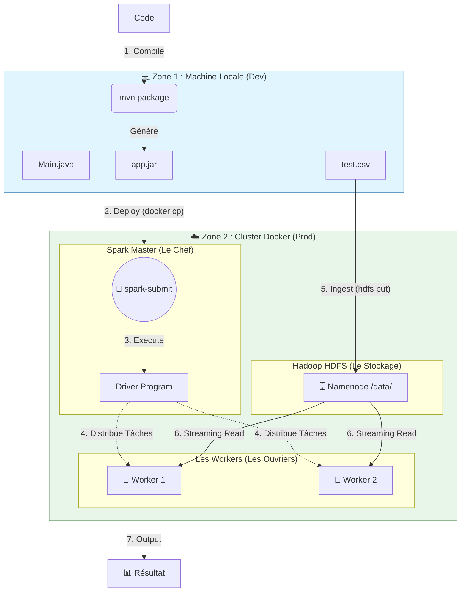

# 🚀 Real-Time Big Data Pipeline with Apache Spark & HDFS

## 📖 Introduction

Ce projet est une implémentation complète d'un pipeline de **traitement de données en temps réel (Streaming)** utilisant une architecture distribuée **Master-Slave**.

L'objectif est de simuler un environnement de production Big Data complet sur une machine locale via **Docker**. Le système ingère des fichiers CSV bruts, les stocke de manière distribuée sur **HDFS** (Hadoop Distributed File System), et les traite à la volée grâce à **Spark Structured Streaming**.

### 🎯 Objectifs du Projet

* Mettre en place une **infrastructure Big Data** conteneurisée (Hadoop + Spark).
* Comprendre et implémenter l'architecture **Master/Worker**.
* Développer une application **Java Spark** agnostique au déploiement.
* Maîtriser le flux de déploiement manuel : **Build Maven → Docker Transfer → Spark Submit**.

-----

## 🏗️ Architecture du Système

Le projet repose sur une séparation stricte entre le **Stockage** (HDFS) et le **Calcul** (Spark), orchestrée par Docker.



### Rôles des Composants

1.  **Spark Master :** Le cerveau. Il reçoit l'application (`.jar`), planifie les tâches et les distribue.
2.  **Spark Workers :** Les muscles. Ils exécutent les calculs en parallèle.
3.  **HDFS Namenode :** Le bibliothécaire. Il gère l'index des fichiers.
4.  **HDFS Datanode :** L'entrepôt. Il stocke physiquement les blocs de données.

-----

## ⚙️ Prérequis

* **Docker** & **Docker Compose** installés et lancés.
* **Java JDK 17** (ou version compatible Spark 3.x).
* **Maven** (pour builder le projet).

-----

## 🚀 Guide de Démarrage (Step-by-Step)

Suivez ces étapes dans l'ordre pour déployer le projet.

### 1\. Démarrer l'Infrastructure

Lancez le cluster Docker définit dans `docker-compose.yaml`.

```bash
docker compose up -d
```

> *Vérification :* Accédez à [http://localhost:8080](https://www.google.com/search?q=http://localhost:8080) (Spark UI) et [http://localhost:9870](https://www.google.com/search?q=http://localhost:9870) (HDFS UI).

### 2\. Initialiser HDFS

Créez le dossier qui recevra les données dans le système de fichiers distribué.

```bash
docker exec -it namenode hdfs dfs -mkdir -p /data
```

### 3\. Compiler l'Application (Build)

Transformez le code Java en exécutable `.jar` via Maven.

```bash
mvn clean package
```

*Le fichier `spark-deploy-1.0-SNAPSHOT.jar` sera créé dans le dossier `target/`.*

### 4\. Déployer sur le Master

Transférez le fichier JAR depuis votre machine Windows vers le conteneur Spark Master.

```bash
# Adaptez le nom du fichier jar si nécessaire
docker cp target/spark-deploy-1.0-SNAPSHOT.jar spark-master:/tmp/app.jar
```

### 5\. Lancer le Job (Spark Submit)

Ordonnez au Master d'exécuter l'application. Cette commande active le **Driver** et met l'application en mode "Écoute" (Streaming).

```bash
docker exec -it spark-master /opt/spark/bin/spark-submit \
  --class abdelkebir.main \
  --master spark://spark-master:7077 \
  /tmp/app.jar
```

> **Note :** Laissez ce terminal ouvert. C'est ici que les résultats s'afficheront.

-----

## 🧪 Test & Ingestion de Données

Pour voir le pipeline réagir, nous allons injecter un fichier CSV.

1.  **Créer un fichier de test** `test.csv` (localement) :

    ```csv
    order_id,client_id,client_name,product,quantity,price,order_date,status,total
    101,10,Ali,Laptop,1,1200.0,2023-12-01,CONFIRMED,1200.0
    ```

2.  **Envoyer le fichier dans le conteneur :**

    ```bash
    docker cp test.csv namenode:/tmp/
    ```

3.  **Déplacer dans HDFS (Le Déclencheur) :**

    ```bash
    docker exec -it namenode hdfs dfs -put /tmp/test.csv /data/
    ```

👀 **Observez le terminal de l'étape 5 \!** Les données doivent apparaître instantanément.

-----

## 📊 Monitoring

| Interface | URL | Description |
| :--- | :--- | :--- |
| **Spark Master UI** | [http://localhost:8080](https://www.google.com/search?q=http://localhost:8080) | Voir les applications "RUNNING" et l'état des Workers. |
| **HDFS Explorer** | [http://localhost:9870](https://www.google.com/search?q=http://localhost:9870) | Naviguer dans les fichiers stockés (`Utilities > Browse`). |

-----

## 🛠️ Dépannage (Troubleshooting)

* **Erreur `Path does not exist: /data`** : Vous avez oublié l'étape 2 (mkdir).
* **Erreur `Connection refused`** : Vérifiez que tous les conteneurs sont "Up" avec `docker ps`.
* **Pas de nouvelles données ?** : HDFS ignore les fichiers qui ont le même nom. Renommez votre fichier en `test2.csv` avant de l'envoyer.

-----

## 👨‍💻 Auteur

**BOUCHTI ABDELKEBIR** - *Ingénieur Logiciel & Sécurité*
Projet réalisé dans le cadre de la préparation au test technique Netopia.
